## 소프트웨어 설계

### 생명주기

- 폭포수
    - 한단계가 끝나야 다음단계로 넘어감
    - 중간에 수정하기 힘듬
- 나선
    - 폭포수 + 프로토타입 + 위험분석 기능 추가된 모델
    - 점진적인 개발과정
- 프로토타입
    - 견본미리 만들어 결과를 예측하는 모델
- 애자일
    - 가장 많이 씀
    - 고객 중심
    - XP,  스크럼, 칸반

개발자 채용공고를 보면 대부분 애자일형태로 개발한다고 써있다..

### UML

- 구성요소
    - 사물

        도형으로 그려짐

        - 구조
        - 행동
        - 그룹
        - 주해 {사물}
    - 관계

        선으로 그려짐

        - 연관
        - 집합
        - 포함
        - 일반화
        - 의존
        - 실체화
    - 다이어그램

- 다이어그램
    - 구조
        - 클래스, 객체
            - 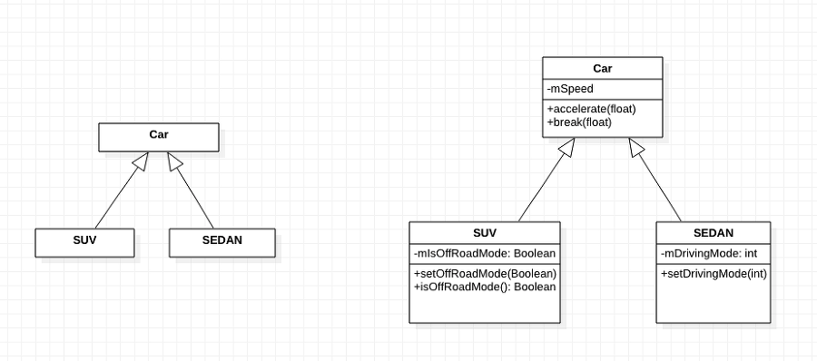

        - 컴포넌트
            - 

        - 배치
            - 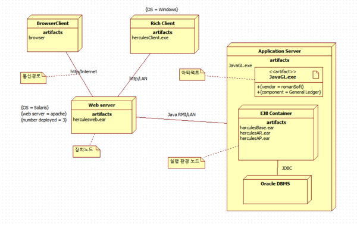

        - 복합체
            - 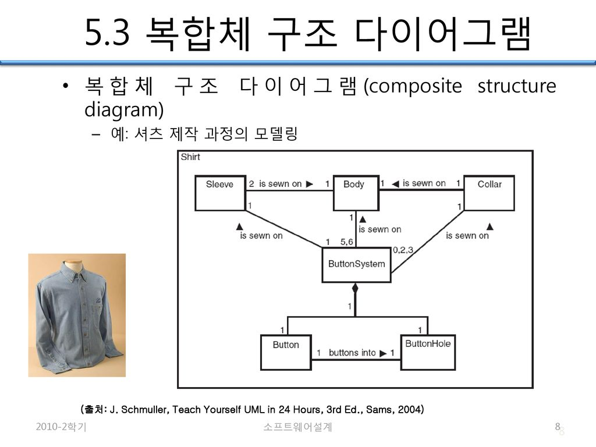

        - 패키지
            - 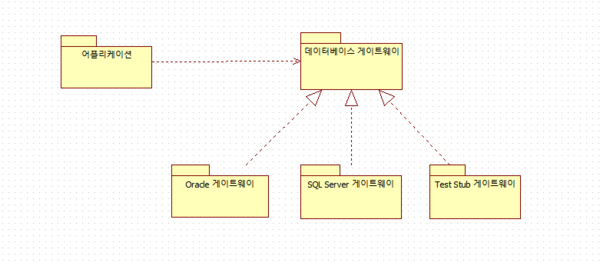

    - 행위
        - 유스케이스
            - 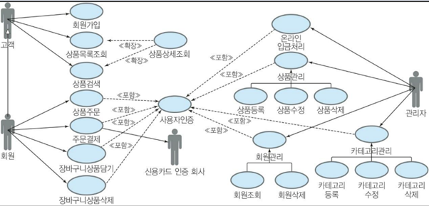

        - 시퀀스
            - 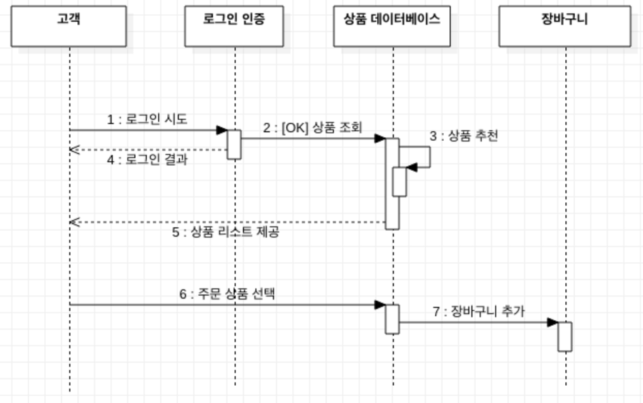

        - 커뮤니케이션
            - 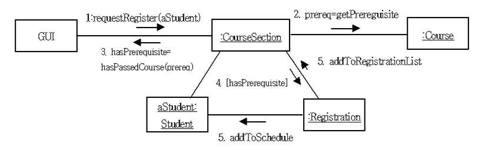

        - 상태
            - 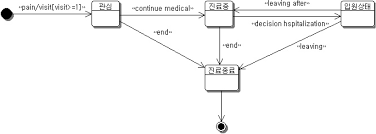
            - xState느낌?

        - 활동
            - 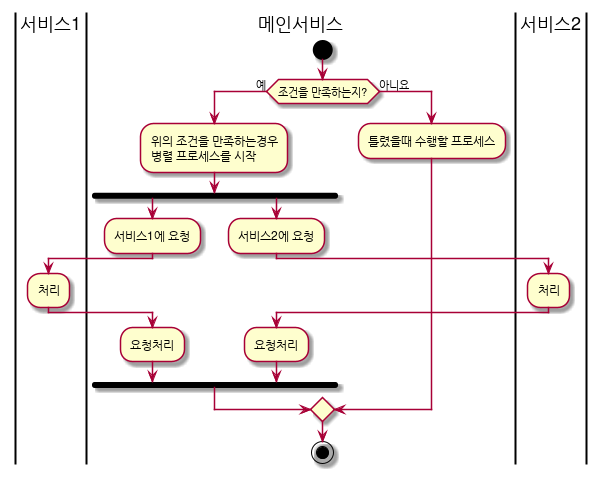
            - 플로우차트와 유사

        - 상호작용
            - 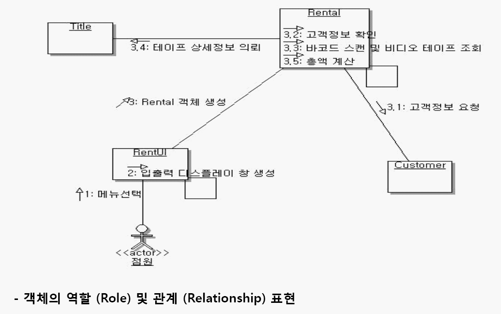

        - 타이밍
            - 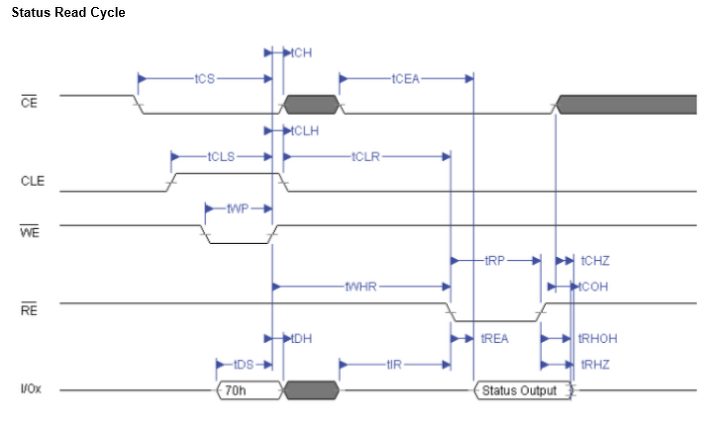

### 소프트웨어 아키텍쳐

- 모듈화
    - 기능을 작은 모듈 단위로 나눔 → 재사용성 향상, 통합 비용 커짐
- 추상화
    - 포괄적인개념을 차례대로 세분화
- 단계적 분해
    - 하향식 설계전략이며, 추상화 반복에 의해 세분화 하는것
- 정보 은닉
    - 모듈 내부에 절차와 자료를 감추어 외부에서 접근하거나 변경하지 못하도록하는 기법

### 아키텍쳐 패턴

- 레이어 패턴
    - 시스템 계층으로 구분하여 작성
- 클라이언트 - 서버 패턴
    - 하나의 서버와 다수의 클라이언트
    - 서로 독립적임
    - 요즘 웹이 SPA - API백엔드서버로 되어있는 것처럼
- 파이프 - 필터 패턴
    - 데이터 스트림 절차로 각 단계마다 캡슐화해 다음 파이프로 전달
    - 확장성, 재사용성 좋음
- MVC
    - 모델-뷰-컨트롤러 형태
    - 기능을 기준으로 나누어 설계, 대화형 애플리케이션에 적합
- 마스터 - 슬레이브 패턴
    - 마스터 컴포넌트에서 슬레이브 컴포넌트로 분할하고, 슬레이브 컴포넌트가 결과물을 마스터 컴포넌트에게 전달함
- 브로커 패턴
    - 컴포넌트와 사용자를 연결해주는 패턴
- 피어 투 피터 패턴
    - 피어를 하나의 컴포넌트로 간주, 각 피어는 서비스를 호출하는 클라이언트가될수도 서버가 될수도있다.
    - 토렌트가 공유되는 방식을 생각해보자
- 이벤트 - 버스 패턴
    - 소스가 특정 채널에 이벤트를 발행하면, 해당 채널을 구독한 리스너들이 메시지를 받아 처리
    - 웹소켓이 이 패턴, 슬랙같이 채팅 애플리케이션에 사용되는 패턴일듯
- 블랙보드 패턴
    - 해결책이 명확하지 않은 문제를 처리하는데 사용
    - 음성인식, 차량 식별
- 인터프리터 패턴
    - 특정 언어로 작성된 코드를 해석할 때 사용

### 객체지향

- 객체란?
    - 독립적으로 식별 가능한 이름을 가짐
    - 객체끼리 상호 연관성에 의한 관계가 성립함
- 클래스란?
    - 하나 이상의 유사한 객체들을 묶어 하나의 공통된 특성으로 표현
        - 동물백과사전을 작성할 때 어떻게 각 동물을 분류할까?를 생각해보자
    - 인스턴스
        - 클래스로 인해 만들어진 객체
    - 메서드
        - 클래스에 포함된 함수. 클래스를 사용하는 방법
    - 메시지
        - 객체에게 어떤 행위를 하도록 지시하는 방법 == 메소드?
- 캡슐화
    - 데이터를 처리하는 함수를  하나로 묶어 세부내용을 은폐함
    - 외부 모듈 변경에 대한 사이드 이펙트가 적음
    - 재사용 향상, 인터페이스 단순해짐 → 리팩토링시 이점을 가져옴
- 상속
    - 부모 클래스 속성과 메소드를 하위 클래스가 물려받는것
    - 재사용성 향상
- 다형성
    - 하나의 공통된 메소드를 가지고 있는 서로 다른 클래스가 고유한 방법으로 응답할 수 이는 능력
        - 문자열과 정수에서의 `+`연산은 다른 결과를 가져온다.

### 결합도 (커플링)

**1) 내용 결합도(Content Coupling)**

- 직접 참조

**2) 공통 결합도(Common Coupling)**

- 공통 영역

**3) 외부 결합도(External Coupling)**

- 변수를 외부에서

**4) 제어 결합도(Control Coupling)**

- 논리적인 흐름 제어

**5) 스탬프 결합도(Stamp Coupling)**

- 자료구조 전달

**6) 자료 결합도(Data Coupling)**

- 매겨변수

### 응집도

1. 우연적
    1. 서로 관련 없는 요소
2. 논리적
    1. 특정 형태로 분류처리
3. 시간적
    1. 특정 시간에 처리
4. 절차적
    1. 순차적으로 수행
5. 통신적
    1. 동일한 입출력 사용
6. 순차적
    1. 출력데이터를 다음 활동의 입력데이터로 사용
7. 기능적
    1. 모든 기능 요소 연관되어 수행

### 공통 모듈

1. 정확성
2. 명확성
3. 완정성
4. 일관성
5. 추적성
6. 재사용

### 코드

- 순차코드
    - 차례대로
- 블록코드
    - 블록으로 구분
- 10진코드
    - 10진 분할 0~9
- 그룹 분류 코드
    - 대중소 그룹 분류
- 연상 코드
    - 관계있는 숫자, 기호 분류
- 표의숫자
    - 물리적 수치로 분류
- 합성 코드
    - 2개이상 코드 조합
- 코드 부여 체계

    이름만으로 개체의 용도와 적용 범위를 알 수 있도록 코드를 부여하는 방식

    - 각 개체에 하여 개체들의 식별 및 추출을 용이하게 함

        유일한 코드 부여

    - 각 단위 시스템의 고유한 코드와 개체를 나타내는 코드가 정의되야 함

        코드를 부여하기 전

### 아키텍쳐 패턴

디자인 패턴  상위 수준 설계

- 생성 패턴

    인스턴스를 만들어내는데 집중

    - [추상](https://www.zerocho.com/category/ECMAScript/post/5f97d22d591c990004e1f5ff)
        - 연관, 의존관계를 추상적으로 표현
    - [빌더](https://www.zerocho.com/category/JavaScript/post/57bab0ee5abe0c17006fe22f)
        - 생성과정과 표현방법 분리
        - 옵션이 많을때 사용
    - [팩토리](https://velog.io/@godori/factory-method-pattern)
        

        - 서브클래스가 인스턴스화될 클래스를 결정함
    - [프로토타입](https://zzossig.io/posts/javascript/what_is_the_prototype_oo_pattern/)
        - 원본 객체 복제 (javascript prototype)
    - [싱글톤](https://www.zerocho.com/category/JavaScript/post/57541bef7dfff917002c4e86)
        - 하나의 인스턴스를 돌려씀 ex) logger
- 구조 패턴
    - [어댑터](https://www.zerocho.com/category/JavaScript/post/57babe9f5abe0c17006fe230)
        - 호환성이 없는  클래스인 경우 변환하여 사용할 수 있게해줌
        - 기존에 있는 구조로 유연하게 대처
    - [브릿지](https://goldenthumb.net/js-design-patterns(Structural))
        - 어댑터 패턴은 두 클래스간의 종속성을 미리 예측하지 못하고 개발했을 경우에 필요한 패턴이고 브리지 패턴은 이미 이들 각각이 독립적으로 진화할수 있음을 파악한 상태에서 적용하는 패턴이다.
        - 구현부에서 추상층을 분리
    - [컴포지트](https://www.zerocho.com/category/JavaScript/post/57bb97735abe0c17006fe232)
        - 여러 객체를 가진 복합, 단일 객체를 구분 없이 다룰 때
        - 주고받는 데이터들을 클래스화해서 생성 및 전달?
    - [데코레이터](https://velog.io/@moggy/Javascript-%EC%9E%A5%EC%8B%9D%EC%9E%90decorator-%ED%8C%A8%ED%84%B4)
        - 필요한 기능을 객체에 동적으로 추가
        - MIxin 개념에 사용가능
    - [퍼사드](https://www.kyungyeon.dev/posts/50)
        - 서브 클래스의 기능들을 최소한으로 외부에 노출함.
        - 기능을 간편하게 사용할 수 있게함
    - [플라이웨이트](https://brownbears.tistory.com/509)
        - 응용 프로그램에서 메모리 사용을 최소화하는 것을 목표
            - 메모리 공유
            - 이벤트관리를 중앙에서함 ex) DOM 레이어 이벤트캐치
    - [프록시](https://velog.io/@lesh/Javascript%EC%97%90%EC%84%9C%EC%9D%98-Proxy-Pattern%EA%B3%BC-Proxy%EA%B0%9D%EC%B2%B4-3njz2d5vl1)
        - 접근이 어려운 객체를 연결해주는 인터페이스 역할
        - 중간단계를 둔다.
- 행위 패턴
    - [책임연쇄](https://www.zerocho.com/category/JavaScript/post/57d24e29fbe82c0015c61245)
        - 동작의 수행을 다음 객체한테 떠넘기는 패턴
    - [커맨드](https://www.zerocho.com/category/JavaScript/post/57c667f2ee0b9e9043fed696)
        - 다른 클래스에 명령을 내리는 패턴, 독립적으로 명령이 조재하여, 새로운 명령을 자유롭게 추가할 수 있음
    - 인터프리터
        - 문법표현을 정의하는 패턴
    - [반복자](https://www.zerocho.com/category/JavaScript/post/57df7063dfe17f0015e44121) (이터레이터)
        - 동일한 인터페이스를 사용하도록 하는 패턴
        - ES2015된 이터레이터 참고
    - [중재자](https://www.imkh.dev/js-design-patterns-mediator/)
        - 객체들의 통신방법을 추상적으로 만들어놓는 패턴
        - 서로의 존재를 모르는 상태에서도 협력가능
        - 채팅의  경우 `송신`-`중재자(전달해주는 역할)`-`수신`
    - [메멘토](https://vallista.kr/2020/06/07/TypeScript-%EB%94%94%EC%9E%90%EC%9D%B8-%ED%8C%A8%ED%84%B4-%EB%A9%94%EB%A9%98%ED%86%A0-%ED%8C%A8%ED%84%B4)
        - 객체의 상태를 특정 시점으로 돌릴 수 있는 패턴
    - [옵서버](https://www.zerocho.com/category/JavaScript/post/5800b4831dfb250015c38db5)
        - 관찰대상의 변화를 탐지하는 패턴
        - 실시간 변동 데이터에 대한 구독을 위해 사용
        - ex) Rxjs, mobx, 이벤트 핸들러
    - [상태](https://victorydntmd.tistory.com/294)
        - 일련의 규칙에 따라 객체 상태를 변화시켜 객체가 할 수 있는 행위를 바꾸는 패턴
        - 상위클래스에 있던 분기처리를 하위 클래스에서 상태에 따라 분기처리를 해주어서,  상위클래스에서는 그 클래스를 가져다 사용하기만하면된다.
    - 전략
        - 사용되는 곳에서 영향을 받지 않는  독립적인 알고리즘을 선택하는 패턴
        - ex) passport.js
    - 템플릿 메소드
        - 공통된 내용을 상위 클래스에 정의하는 패턴
    - [방문자](https://nwlee.app/posts/javascript-design-pattern/#%EB%B0%A9%EB%AC%B8%EC%9E%90-%ED%8C%A8%ED%84%B4)
        - 필요할 때마다 클래스에 방문해서 처리하는 패턴

### 인터페이스 요구사항 검증

- 게획 → 검토 → 베이스라인
- 검증
    - 동료
    - 워크 스루
    - 인스펙션
- 항목
    - 기능성
    - 완정
    - 일관
    - 명확
    - 검증가능
    - 추적가능
    - 변경 용이

### 미들웨어 솔루션

- db
    - 클라이언트와 원격의 데이터베이스 연결을 위함 2-tier
- RPC
    - 원격의 프로시저를 로컬 프로시저처럼 호출
- Message Oriented Middleware
    - 메세지 기반 비동기 메세지 전달
- Transaction Processing Monitor
    - 항공기나 철도 예약업무 같은 온라인 트랙잭션업무에서 사용, 빨라야함
- Object Request Broker
    - 객체지향 미들웨어 코바 표준  스펙
- Web Application Server
    - 동적인 컨텐츠를 처리