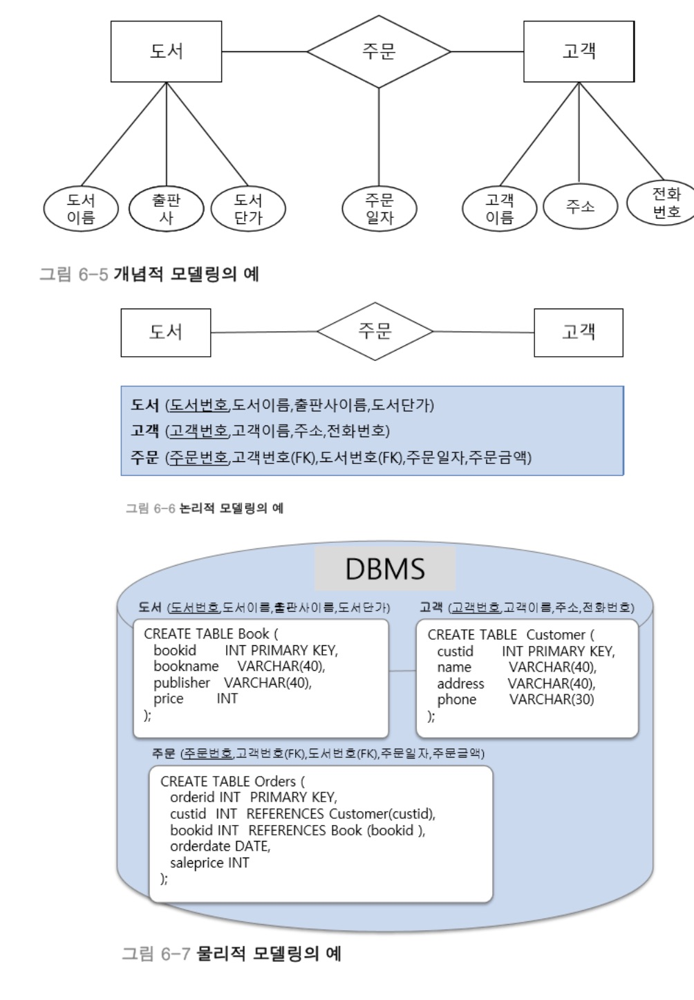

## 요구사항 분석과 시스템 설계
---

<br />

### 정보시스템  실제 구축 절차
---
1. 분석
	- 제일 많은 문서를 작성하는 단계로, 무엇을 할지 결정하는 단계.
2. 설계
	- 시스템 설계. 구축하고자 하는 시스템을 어떻게 할지를 결정하는 단계
3. 구현
	- 분석과 설계의 결과로 나온 문서로 프로그래머가 해당 내용을 코드로 실체화하는 단계
4. 시험
	- 배포전 테스트
5. 유지보수

- 개념
	-  RDBMS DB서버 내부에는 N개의 스키마가 존재한다.
	- 스키마 내부에는 N개의 테이블이 존재한다.
	- 테이블은 N개의 컬럼으로 정의되고, 정의된 구조로 데이터가 row형태로 쌓이게된다.

- 좋은 모델링
	- 모델링에는 정답이 없다. 하지만 실제 서비스를 운용하면서 효율적인 좋은 모델링이 있고, 비효율적인 나쁜 모델링이 있다. 어떤 구조가 좋은 모델링인지 빨리 파악하기위해서는 많은 경험이 필수적이다.

#### 모델링 종류
- 개념적 모델링
	- 업무 분석단계에서 진행된다. 서비스를 운용하는데 필요한 주요 개념과 진행되는 업무 프로세스 등을 식별하여 정리한다.
	- 정리된 개체들을 바탕으로 ERD를 만든다.
- 논리적 모델링
	- 개념적으로 만들어진 ERD를 바탕으로 사용할 DBMS에 맞게 설계한다.
	- ERD를 바탕으로 스키마를 만든다.
- 물리적 모델링
	- DBMS에 물리적으로 저장하기 위한 물리적 구조와 방법을 설계한다.
	- 각 스키마에 대한 관계를 설정한다.


<br />

## 용어
---
- 데이터베이스 모델링
	- 현실세계의 데이터를 DB에 어떻게 옮길것인지 결정하는 과정이라고 생각하면된다.
- table
	- 데이터를 표 형태로 표현한 것(column + rows)
- column
	- 각 열을 구분하기 위한 열의 이름
- row
	- 테이블
- PK (Primary Key)
	- 각 row를 구분하는 유일한 column. 데이터마다 고유값을 가져야하는 경우가 많다. 이럴 때 PK지정은 필수이다.
- FK (Foreign Key)
	- 테이블끼리 관계를 형성하기위해 사용되는 column.


## DBMS에 존재하는 다른 기능들
---

<br />

### Index
- 테이블에 색인을 두어 쿼리 요청시간을 단축시켜준다.
	- 이런식으로 DBMS의 특정기능을 사용해 성능을 높이는 것을 DB 튜닝이라고 부른다.
	- index되지않은 컬럼을 SELECT문으로 조회하는 경우 테이블을 full scan하게된다. 쿼리실행시 어떻게 쿼리가 작동했는지 알고 싶은경우엔 mysql workbench의 `Excution Plan` 기능을 활용하여 확인할 수 있다.
- 테이블의 column 단위로 생성된다.
```sql
CREATE INDEX idx_col_name ON table_name(col_name); -- index_col_name이라는 이름으로 col_name 컬럼에 인덱스가 추가되었다.
```


### View
- 보안 및 재활용을 위해 작성한 읽기 전용 가상 테이블. 사실상 진짜 테이블을 조회하는것과 비슷하다. 권한이 없는 사람에게 테이블의 전체 내용을 공유할 수 없을때 사용하기도 한다.
```sql
CREATE VIEW view_table_name
AS
	SELECT col1, col2 from table_name;
```

### Stored Procedure
- 반복작업을 하나로 묶어주는 기능. N개의 SELECT 문을 Procedure로 묶으면 함수처럼  호출하여 한번에 다 실행시킬 수 있다. (실무에서 자주 사용된다.)
```sql
DELIMITER//
CREATE PROCEDURE proName()
BEGIN
	SELECT * FROM table_name WHERE col1 = 'a';
	SELECT * FROM table_name WHERE col1 = 'b';
	SELECT * FROM table_name WHERE col1 = 'c';
END//
DELIMITER//
```

### Trigger
- `INSERT`나 `UPDATE` 작업처럼 데이터를 변형시키는 경우, 리스너를 등록한것처럼 특정 쿼리를 실행시킬 수 있는 기능 (이 부분은 업무분장이 확실하게 나누어져있지 않는 경우에는 사용하지 않을거같다.)
	- ex. 회원탈퇴시, 회원의 로그인기록을 삭제가 필요할 때. 회원테이블에 특정 데이터가 `UPDATE`되면 로그인기록테이블을 수정하는 쿼리를 trigger로 작성하는 것이다.
```sql
DELIMITER //
CREATE TRIGGER trigger_name
	ALTER DELETE -- DELETE 쿼리가 실행되면
	ON memberTBL
	FOR EACH ROW -- 각 행에 적용시킨다.
BEGIN -- 아래 쿼리를
	INSERT INTO deletedMemerTBL
		VALUES (OLD.memberID, OLD.memberName)
DELIMITER

```

<br />

## 백업과 복원
---

- 백업
	- 현상태의 데이터베이스를 다른 매체에 보관하는것
	- 실무에서는 주로 클라우드에 DB를 올려놓기 때문에 주기적으로 DB를 백업해야한다. 유저가 잘 접속하지 않는 시간대에 백업을 수행하는 cron job을 등록하는것도 하나의 방법이다. [(예시)](https://dalgoo.tistory.com/17)
- 복원
	- 현재의 데이터베이스를 백업 데이터로 원상태로 돌려놓는것
	- mysql workbench사용시 import Data 기능을 사용해 덤프파일이나 sql파일을 import할 수 있다.