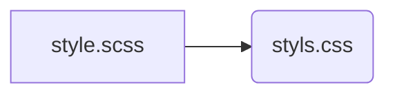

[TOC]


# About Sass

Sass는 기존 CSS의 한계와 단점을 보완하여 가독성이 높고 코드의 재사용에 유리한 CSS를 생성하는걸 도와주는 CSS의 확장이다.

Sass는 다음과 같은 추가기능과 유용한 도구를 제공한다.

- 변수의 사용
- 조건문과 반복문
- Import
- Nesting
- Mixin
- Extend/Inheritance

CSS와 비교하여 Sass는 아래와 같은 장점이 있다.

- 간단한 표기법으로 CSS를 구조화하여 표현할 수 있다.
- 스킬 레벨이 다른 팀원들과의 작업 시 발생할 수 있는 구문의 수준 차이를 평준화할 수 있다.
-  Mixin 등의 강력한 기능을 활용하여 CSS 유지보수 편의성을 큰 폭으로 향상시킬 수 있다.


# Sass 컴파일

Sass는 CSS-preprocessor이지 표준이 아니다.  그래서 브라우저가 이해하지 못한다. 브라우저가 이해하는건 CSS이므로 `.css` 확장자로 변환해주는 일이 필요하다.



**node-sass 사용시**

```bash
## 특정 파일을 특정 파일 이름으로 컴파일
## Compile foo.scss to bar.css
$ node-sass foo.scss > bar.css

## 폴더 내의 모든 파일을 컴파일
## node-sass input-folder-path -o output-folder-path
$ node-sass src/sass --output dist/css

## output될때 스타일지정
$ node-sass --output-style nested src/sass --output dist/css
$ node-sass --output-style expanded src/sass --output dist/css
$ node-sass --output-style compact src/sass --output dist/css
$ node-sass --output-style compressed src/sass --output dist/css

## 변경을 감지하여 자동으로 컴파일

## 파일 단위 
## watch src/sass/foo.scss -> dist/css
$ node-sass --watch src/sass/foo.scss --output dist/css
## 폴더 단위
## watch src/sass -> dist/css
$ node-sass --watch src/sass --output dist/css
```


# 1. 프로그래밍언어같은 Sass


## 1.1 Data Type

- 숫자형
  - 1.2, 13, 10px
- 문자형
  - CSS는 2종류의 문자열을 사용할 수 있다. 따옴표를 사용하는 경우(“Lucida Grande”, ‘http://sass-lang.com’)와 사용하지 않는 경우(bold, sans-serif)가 있다. Sass는 2종류의 문자열 모두를 인식할 수 있으며 컴파일 후의 CSS에는 Sass에서 사용한 문자열이 그대로 출력된다. e.g. “Lucida Grande”, ‘http://sass-lang.com’, sans-serif
- 컬러
  - blue, #04a3f9, rgba(255, 0, 0, 0.5)
- boolean
- null
  - 프로퍼티 값에 값이 null인 변수가 지정되면 해당 룰셋은 출력되지 않는다.
- list
  - 1.5em 1em 0 2em, Helvetica, Arial, sans-serif
  - 자바스크립트의 배열과 유사
- map
  - JSON과 유사한 방식으로 `map-get` 함수를 사용하여 원하는 값은 추출할 수 있다. e.g. (key1: value1, key2: value2)

```scss
// map
$foundation-palette: (
  primary: #E44347,
  mars: #D7525C,
  saturn: #E4B884,
  neptune: #5147D7
);

.mars {
  color: map-get($foundation-palette, mars); // => .mars { color: #D7525C; }
}
```


## 1.2 변수

변수명은 `$`로 시작한다.

```scss
$site_max_width: 960px;
$font_color: #333;

body{
    width: $site_max_width;
    color: $font_color;
}
```


```css
/*  결과  */
body{
    width: 960px;
    color: #333px;
}
```


변수를 코드블록내에서도 선언할 수 있는데 그럴시엔 지역변수가 된다. 이때 전역변수로 만들고싶으면 뒤에 `!global` 을 붙이면 된다.

```scss
#main {
  $color: #333 !global;
  width: $width;
  ...
```


## 1.3 연산자

```scss
$width: 100px;

#foo {
  width: $width + 10; // 110px
}

#bar {
  width: $width + 10in; // 1060px 
}


#foo {
  width: $width + 10em; // error: 100px + 10em // %, em, rem, vh, vw, vmin, vmax과 같이 상대적인 값은 절대적인 값과  계산안됨!!
}

#foo {
  width: 5% + 10%; // 15%
}
```


CSS에서의 `/`는 나눗셈의 의미가 아니라 값을 분리하는 의미를 갖는다.

따라서 Sass의 `/` 연산자를 사용하기 위해서는 몇가지 조건이 필요하다.

- 변수에 대해 사용
- 괄호 내에서 사용
- 다른 연산의 일부로서 사용

```scss
width: $width / 2;            // 변수에 대해 사용 →　width: 500px;
height: (500px / 2);          // 괄호 내에서 사용 →　height: 250px;
margin-left: 5px + 8px / 2px; // 다른 연산의 일부로서 사용 →　margin-left: 9px;
```


변수를 CSS의 /와 함께 사용하고자 하는 경우 `#{}`(Interpolation)를 사용한다.

```scss
p {
  $font-size: 12px;
  $line-height: 30px;
  font: #{$font-size}/#{$line-height};  // 12px/30px
}	
```


alpha값은 연산되지 않는다. alpha값의 연산은 opacify() 또는 transparentize() 함수들을 사용한다.

```scss
p {
  color: rgba(255, 0, 0, 0.75) + rgba(0, 255, 0, 0.75);
  // alpha 값은 연산되지 않는다
  // color: rgba(255, 255, 0, 0.75);
}

$translucent-red: rgba(255, 0, 0, 0.5);

p {
  color: opacify($translucent-red, 0.3);
  // => color: rgba(255, 0, 0, 0.8);

  background-color: transparentize($translucent-red, 0.25);
  // => background-color: rgba(255, 0, 0, 0.25);
}


```


문자열도 더할 수 있다.

따옴표가 있는 문자열과 없는 문자열을 함께 사용하는 경우, 좌항의 문자열을 기준으로 따옴표를 처리한다.

```scss
p:before {
  content: "Foo " + Bar;        // "Foo Bar"
  font-family: sans- + "serif"; // sans-serif
}
```


## 1.5 interpolation: #{}

인터폴레이션은 변수의 값을 문자열 그대로 삽입한다. `#{}`을 사용하면 프로퍼티값은 물론 셀렉터와 프로퍼티명에도 사용할 수 있다.

```scss
$name: foo;
$attr: border;

p.#{$name} {            // p.foo
  #{$attr}-color: blue; // border-color: blue;
}

.someclass {
  $font-size: 12px;
  $line-height: 30px;
  // 연산의 대상으로 취급되지 않도록
  font: #{$font-size} / #{$line-height}; // 12px / 30px
}
```


## 1.6 Ampersand(&)

`&`는 부모요소를 참조하는 셀렉터이다.

```scss
a {
  color: #ccc;

  &.home {
    color: #f0f;
  }
}
```

```css
/*  결과  */
a {
  color: #ccc;
}

a.home {
  color: #f0f;
}
```


## 1.7 !defalut

!default flag는 할당되지 않은 변수의 초기값을 설정한다.

이러한 특성은 [partial](http://sass-lang.com/documentation/file.SASS_REFERENCE.html#Partials__partials)에 매우 유용하다.

2개의 파일 _font.scss와 main.scss를 생성해 보자. main.scss은 내부에서 _font.scss을 import한다.

```scss
// _font.scss
$font-size: 16px !default;
$line-height: 1.5 !default;
$font-family: "Helvetica Neue", "Helvetica", "Arial", sans-serif !default;  // null 이 아닐경우에만 이 값을 쓴다

body {
  font: #{$font-size}/$line-height $font-family;
}

```

```scss
// main.scss
$font-family: "Lucida Grande", "Lucida Sans Unicode", sans-serif;

@import "font";

```

위 코드의 컴파일 결과는 아래와 같다. !default는 변수에 값이 할당되지 않았을 때 사용할 기본값을 지정할 때 사용한다. 위 예제의 경우, main.scss에서 변수에 값을 할당하였기 때문에 !default와 같이 사용한 변수값은 무력화된다.

```css
/*  컴파일된 결과  */
body {
  font: 16px/1.5 "Lucida Grande", "Lucida Sans Unicode", sans-serif; 
}
```


```scss
// _vars.scss
$width: 960px;

```

```scss
// _header.scss
#header {
  width: $width;
}

```

```scss
// _sidebar.scss
#sidebar {
  width: $width;
}

// _footer.scss
#footer {
  width: $width;
}

// style.scss
@import "partial/vars";
@import "partial/header";
@import "partial/sidebar";
@import "partial/footer";
```


## 1.8 Nesting

Sass의 유용한 확장 기능으로 선언을 **중첩(Nesting)**하는 것

```css
#navbar {
  width: 80%;
  height: 23px;
}

#navbar ul {
  list-style-type: none;
}

#navbar li {
  float: left;
}

#navbar li a {
  font-weight: bold;
}
```


Sass 사용시 같은 단어의 중복사용을 줄일 수 있다.

```scss
#navbar {
  width: 80%;
  height: 23px;

  ul { list-style-type: none; }

  li {
    float: left;
    a { font-weight: bold; }
  }
}
```


## 1.9 if()

if() 함수는 주어진 조건을 판단하여 결과를 리턴한다. Javascript의 삼항연산자와 유사하게 동작한다.

```scss
if(condition, if_true, if_false) // === condition ? if_true : if_false

```

condition이 true이면 if_true를, false이면 if_false를 반환한다.

```scss
$type: ocean;

p {
  color: if($type == ocean, blue, black); // color: blue;
}
```


```scss
$type: monster;

p {
  @if $type == ocean {
    color: blue;
  } @else if $type == matador {
    color: red;
  } @else if $type == monster {
    color: green;
  } @else {
    color: black;
  }
}
```


## 1.10 @for

@for으로 반복문을 사용할 수 있다.

```scss
@for $i from 1 through 3 {
  .item-#{$i} { width: 2em * $i; }
}

```

컴파일 결과는 아래와 같다.

```css
.item-1 {
  width: 2em;
}
.item-2 {
  width: 4em;
}
.item-3 {
  width: 6em;
}
```


## 1.11 @each

@each와 list 또는 map의 요소에 대해 반복을 실시한다.

```scss
// List
@each $animal in puma, sea-slug, egret, salamander {

  .#{$animal}-icon {
    background-image: url('/images/#{$animal}.png');
  }
}

// Map
// $header: h1, $size: 2em
// $header: h2, $size: 1.5em
// $header: h3, $size: 1.2em
@each $header, $size in (h1: 2em, h2: 1.5em, h3: 1.2em) {
  #{$header} {
    font-size: $size;
  }
}
```

컴파일 결과는 아래와 같다.

```css
.puma-icon {
  background-image: url("/images/puma.png");
}

.sea-slug-icon {
  background-image: url("/images/sea-slug.png");
}

.egret-icon {
  background-image: url("/images/egret.png");
}

.salamander-icon {
  background-image: url("/images/salamander.png");
}

h1 {
  font-size: 2em;
}

h2 {
  font-size: 1.5em;
}

h3 {
  font-size: 1.2em;
}
```


## 1.11 @while

@while으로 반복문을 사용할 수 있다.

```scss
$i: 6;
@while $i > 0 {
  .item-#{$i} { width: 2em * $i; }
  $i: $i - 2;
}

```

컴파일 결과는 아래와 같다.

```css
.item-6 {
  width: 12em;
}

.item-4 {
  width: 8em;
}

.item-2 {
  width: 4em;
}
```


## 1.11 @mixin

Mixin은 Sass의 매우 유용한 기능으로 중복 기술을 방지하기 위해 사용 빈도가 높은 마크업을 사전에 정의하여 필요할 때에 불러 사용하는 방법이다.

사용법은 매우 간단하다. `@mixin` 선언하고 `@include`로 불러들인다.

```scss
// 지름이 50px인 원
@mixin circle {
  width: 50px;
  height: 50px;
  border-radius: 50%;
}

// 지름이 50px인 원을 위한 mixin을 include한 후, 배경을 추가 지정
.box {
  @include circle;

  background: #f00;
}

/*  컴파알  */
.box {
  width: 50px;
  height: 50px;
  border-radius: 50%;
  background: #f00;
}
```


유용한 예제

```scss
@mixin vendorPrefix($property, $value) {
  @each $prefix in -webkit-, -moz-, -ms-, -o-, '' {
    #{$prefix}#{$property}: $value;
  }
}

.border_radius {
  @include vendorPrefix(transition, 0.5s);
}

.border_radius {
  -webkit-transition: 0.5s;
  -moz-transition: 0.5s;
  -ms-transition: 0.5s;
  -o-transition: 0.5s;
  transition: 0.5s;
}
```


```scss
@mixin position($position, $top: null, $right: null, $bottom: null, $left: null) {
  position: $position;
  top: $top;
  right: $right;
  bottom: $bottom;
  left: $left;
}

.box {
  @include position(absolute, $top: 10px, $left: 50%);
}

.box {
  position: absolute;
  top: 10px;
  left: 50%;
}
```


## 1.12 Function

Function은 mixin과 유사하나 리턴값에 차이가 있다.

- mixin : **style**을 리턴
- function : @return directive를 통하여 **값**을 리턴

```scss
$grid-width: 40px;
$gutter-width: 10px;

@function grid-width($n) {
  @return $n * $grid-width + ($n - 1) * $gutter-width;
}

#sidebar { width: grid-width(5); }  // width: 240px;
```


# 기능은 많지만...

다 외워서 전부 쓸 필요는 없다. 내가 필요한 것만 쏙쏙 뽑아서 쓰면된다. 

nesting, 변수, @mixin 기능만 사용해도 일반css를 작성하는것과 비교하면 엄청나게 효율적이다.