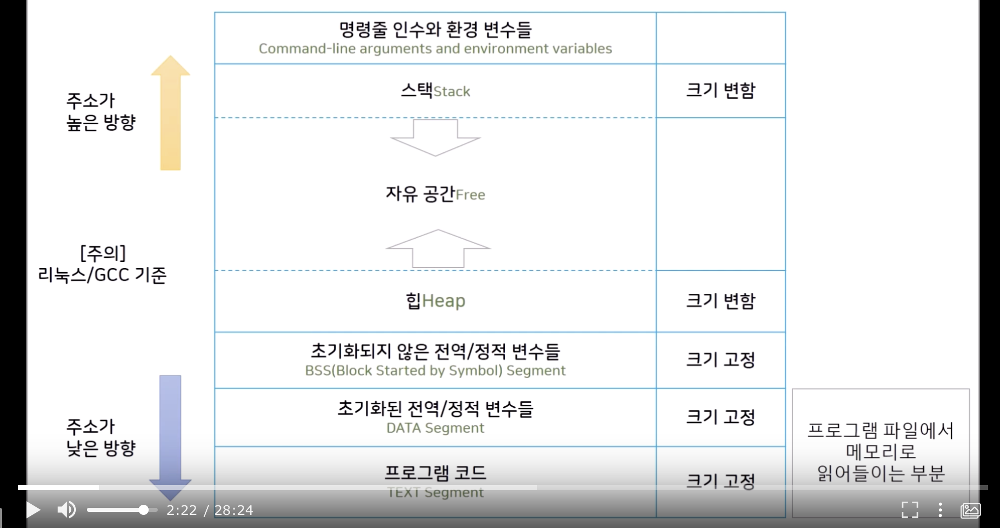

# get next line

## 요약

- 파일을 읽어서 출력한다.
- 오류에 대한 처리와 개행을 만났을 때의 처리를 적절하게 해야한다.

## 정리

### `open()`

```c
int open(const char *pathname, int flags);
int open(const char *pathname, int flag, mode_t mode);
```

- 원시적인  시스템콜을 가지고 파일의 입출력을 받기위해 파일 디스크립터를 얻을 때 사용함. (반환된 값)
- `pathname`
    - 파일의 경로명
- `flags`
    - 입출력을 어떻게 다룰지 결정함. 메뉴얼에서 확인가능
        - O_READ
            - 읽기전용
        - O_CREAT
            - 파일이 없으면 생성
- `mode`
    - 파일 생성시 권한을  주는 옵션
- 반환값
    - 음수면 open실패 정수면 해당 값을 읽을때 사용된 파일디스크립터

### `read()`

```c
size_t read(int fd, void* buf, size_t len);
```

- `fd`
    - 파일 디스크립터. 파일에 대한 입출력시 필요한 정수값
- `buf`
    - 파일을 읽어들일 버퍼. 이사를 하는 경우 짐을 나르는 트럭의 역할
- `len`
    - 한번에 버퍼에 쓸 크기를 결정한다
- 반환값
    - 읽은 바이트 수

### `write()`

```c
size_t write(int fd, const void *buf, size_t nbytes);
```

- `fd`
    - 파일 디스크립터. 파일에 대한 입출력시 필요한 정수값
- `buf`
    - 파일에 쓸 버퍼. 이사를 하는 경우 짐을 나르는 트럭의 역할
- `nbytes`
    - 얼마만큼의 크기의 바이트를 쓸것인지에 대한 정수값
- 반환값
    - 성공시 쓰여진 바이트 수, 실패시 음수 `-1`

### 컴퓨터에서 메모리가 사용되는 구조



따배씨 - 11.2 메모리 레이아웃과 문자열

- 컴퓨터는 프로그램을 실행시킬때 메모리를 데이터를 저장하기위해 사용한다.
- 함수내부의 변수들은 스택영역에 저장되고, 동적할당된 변수는 힙영역에 저장된다.
- 함수내부의 변수들은 함수가 실행될 때, 스택형식으로 쌓였다가 사용되면서 스택에서 사라지게 된다. → 함수의 라이프사이클이 끝나면 해당 변수도 끝나게된다.
- 해당 과제에서 정적 변수를 쓴 이유는?
    - 이전에 읽었던 내용을 저장해야하기 때문에`정적변수`를 쓴다. 정적변수는 스택영역에 쌓이지않기 때문에 함수의 라이프사이클이 끝나도 데이터를 가지고 있다.
- BUFFER_SIZE값에 아주 큰 값을 주면 오류가 나는 이유는?
    - 메모리 크기는 유한하다. 전달된 값만큼 메모리를 확보해야하는데 그만큼의 메모리가 없으면 프로그램이 제대로 작동할 수 없게되는것이다.
    - 여기서 사용한 정적변수는 초기화되지 않은 정적변수여서 BSS Segment에 할당됨.
- DATA Segment 영역은 일기전용, 읽기/쓰기 전용으로 나누어져 있다.

    ```c
    char *s1[] = "test"; // 읽기 쓰기 둘다 가능
    char *s2 = "test"; // 읽기만 가능
    s2[1] = 'a'; // 오류 발갱
    ```

    - s1의 경우 메모리를 할당한것
    - s2의 경우 test라는 글자가 적힌 메모리를 가리키고 있는 것
    - 자바스크립트에서도  `s1[1] = 'a'` 이런식으로 문자열을 수정할 수 없다. v8같은 엔진에서 문자열을 다룰때 읽기전용으로만 다루기 때문에 그런듯하다.

### 파일 디스크립터란?

- 리눅스, 유닉스 계열의 시스템에서 파일에 접근시 사용하는 정수 값이다.
- 새로운 파일이 열릴때는 사용하지 않는 파일 디스크립터중 가장 작은 값을 가져와 사용한다.
    - 최대값은 `getconf OPEN_MAX` 로 확인 가능하다
- `0`, `1`, `2`는 `STD_IN`, `STD_OUT`, `STD_ERROR`의 파일 디스크립터로 항상 운영체제가 사용중이다.

### 로직 요약

1. 파일 디스크립터와 read함수로 내용을 읽어 버퍼에 씀
2. 버퍼에 개행이 있는지 확인함
    1. 있는 경우
        1. 개행이 나타나는 인덱스 전까지 정적변수에 저장된 데이터와 join하여 리턴함
    2. 없는 경우
        1. 정적변수로 저장해왓던 데이터와 join하여 정적변수의 길이를 증가시킴
        2. 다음 read를 실행함

```c

메모리구조
[a][a][a][a][a][a][a][a]

쭉 이어붙임 (save_line)

이어 붙이다 보면 공백을 만남
[a][a][a][a][a][a][a][a][\n]b][b][b][b]
공백을 기준으로 좌우로 잘라야함 (make_line)

[a][a][a][a][a][a][a][a] <- line으로 보냄
get_next_line함수 밖에서 사용함

[b][b][b][b] <- storage로 보냄
```

---

### 평가시 얻었던 TIP

- 업데이트 전에 할당필요
- -D 정의옵션으로 BUFFER_SIZE 지정함
- 디스크립터값이 0일때 standard input으로 계속 진행되어야함. CTRL + D 누를시 종료
- 파일의 끝이 개행으로 끝나는 경우
- 파일 디스크립터의 크기를 조회하는 명령어 - 까먹음
- 보너스문제는 단순히 save하는 부분을 배열로 만들면 됨 - limits.h에서 OPEN_MAX값을 활용
- 누수가 있으면 안됨...
- 보너스 파일엔 보너스 헤더를 사용할것...
- 모든 누수를 확인하자. 직접 main함수를 만들어 보자

### 자료

- [https://projects.intra.42.fr/projects/42cursus-get_next_line](https://projects.intra.42.fr/projects/42cursus-get_next_line)
- [[리눅스] 리눅스 파일 열기(OPEN), 읽기(READ), 쓰기(WRITE) 구현](https://reakwon.tistory.com/39)
- [[GetNextLine] 삽질의 기록](https://velog.io/@hidaehyunlee/GetNextLine-%EC%82%BD%EC%A7%88%EC%9D%98-%EA%B8%B0%EB%A1%9D)
- [GNL(Get Next Line) 문제 이해하기](https://epicarts.tistory.com/154)
- [NULL과 \0의 차이](https://linuxism.ustd.ip.or.kr/95)
- 테스터기
    - [https://github.com/Hellio404/Get_Next_Line_Tester](https://github.com/Hellio404/Get_Next_Line_Tester)
        - 빡셈
    - [https://github.com/harm-smits/gnl-unit-test](https://github.com/harm-smits/gnl-unit-test)
        - 설명은 별로 없지만 여러 파일을 확인하는듯?
    - [https://github.com/charMstr/GNL_lover](https://github.com/charMstr/GNL_lover)
        - 설명은 잘해주지만 통과해도 다른곳에서 틀림
    - [https://github.com/Mazoise/42TESTERS-GNL.git](https://github.com/Mazoise/42TESTERS-GNL.git)
        - 가장 간단한 테스터?
    - [https://github.com/DontBreakAlex/gnlkiller.git](https://github.com/DontBreakAlex/gnlkiller.git)
        - 바이트 별로 확인해줌 (간단한 테스터)
    - [https://github.com/charMstr/GNL_lover.git](https://github.com/charMstr/GNL_lover.git)
        - 설명 자세함