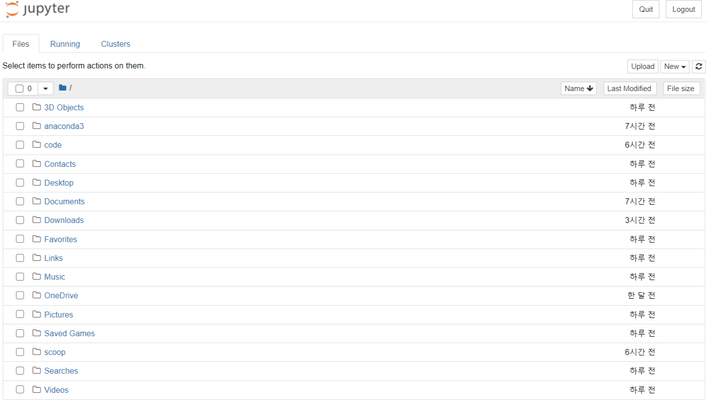

# 개발환경 설정

날짜: 2020년 10월 7일


### 아나콘다

- 파이썬 개발시, 수많은 패키지들을 쉽게 사용, 관리할 수 있는 프로그램

    [Anaconda | Individual Edition](https://www.anaconda.com/products/individual)

- 요즘 떠오르는 개발환경 코랩
    - 구글에서 제공하는 파이썬 실행 환경 (구글의 주피터 노트북 ?)
    - 구글 드라이브 연동가능, 코드의  실행환경은 구글의 클라우드 컴퓨터에서 실행됨

        → 사용자의 디바이스의 기능에 상관없이 같은 성능을 낼 수 있다. 


### 아나콘다 프롬프트 (Anaconda Powershell Prompt)

---

```python
python

Python 3.8.3 (default, Jul  2 2020, 17:30:36) [MSC v.1916 64 bit (AMD64)] :: Anaconda, Inc. on win32
	Type "help", "copyright", "credits" or "license" for more information.
```

파이썬 코드를 실행시킬 수 있는 개발 환경을 만들기위해서는  `python`을 입력하면 된다. 이 때 본인의 파이썬 버전이 보여지며, `>>>`  표시가 보이면서 파이썬 명령어를 입력할수 있는 파이썬 콜솔 환경이 만들어 진다. 콘솔환경은 휘발성이기 때문에 입력한 코드를 저장하려면 파일로 저장해야한다.


### 파이썬 개발환경 1 - Spyder

---

아나콘다 배포판에는 `Spyder` 라는 IDE가 포함되어있다. `Spyder` 에 포함되어있는 `IPython` 콘솔과 내장 편집기를 사용하는 방법을 알아보자 


좌측영역은 코드를 작성하고 저장할 수 있는 영역이다. 우측하단 영역은 파이썬코드를 실행 시킬 수 있는 개발 환경이다. (자바스크립트의 경우 vscode에서 디버깅하거나 브라우저의 개발자도구에서 확인할 수 있었던 부분을 파이썬은 프로그램이 필요함...)


### 파이선 개발환경 - 주피터 노트북

---

- [공식 도큐멘트](https://jupyter-notebook.readthedocs.io/en/stable/index.html)
- 코드 작성이 가능하고, 문서 작성 또한 편하게 작성하고 공유할 수 있다. 이때문에 과학분야에서 널리 이용된다고 한다.   Spyder 보다 더 많이 사용됨

- 실행시, 주피터 노트북이 로컬서버에 개발환경(클라이언트단, 서버단 둘다)을 자동으로 구성해주며, 로컬서버에 접속하게되면 해당 화면이 보여지게된다.

    

    웹 프로젝트가 실행되기때문에 어느 운영체제에서 보든 같은 UI를 보여준다.

    디렉토리를 관리하는 화면이나, 파일을 수정하는 편집기화면은 다른 편집기들과 비슷한점이 많다.

- 주피터 노트북 작동원리

    주피터 노트북 편집기에서 코드조각을 실행하게되면,코드가 주피터 노트북 커널로 보내지고, 노트북 커널은 실행결과를 서버로 다시 전송한다. 그 결과가 주피터 노트북 프론트단에 보여지게된다.

    이 형태의 아키텍쳐는 어떤 언어로건 코드를 전송할 수 있다는 점이다. R언어로 작성하게되면 노트북상에 있는 R커널로 전송되어 R커널로 실행한 결과를 노출하게된다.

    지원되는 커널의 종류는 [링크에서 확인가능](https://kevinthegrey.tistory.com/71) 같다.


### 기타 정보

---

- 주석 추가방법
    - `#` 한줄
    - `"""  """` 여러줄
- latex
    
    - 논문작성시 자주 사용되는 툴
- 주피터 노트북
    - 편집기 상에서 [ `n` ] 에서 보여지는 부분은 실행횟수임
    - new File로 생성된 파일의 경우 `.ipynb` 확장자로 보여지게 된다.
    - 단축키

        편집기상에 아이콘이 있지만 단축키를 사용하는게 더 편하기때문에 정리..

        - Command Mode ( press Esc to enable)
        - **shift-Enter :** run cell, select below
        - **Ctrl-Enter** : run cell
        - **Alt-Enter** : run cell, insert below
        - **Y** : to code
        - **M** : to markdown
        - **B** : insert cell below
        - **X** : cut selected cell
        - **C** : copy selected cell
        - **Shift-V** : paste cell above
        - **V** : paste cell below
        - **Z** : undo last cell deletion
        - **D,D** : delete selected cell
        - **Shift-M** : merge cell below
        - Edit Mode ( press Enter to enable)
        - **Shift-Tab** : 툴팁표시
        - **Ctrl-]** : indent
        - **Ctrl-Shift-** : split cell

### 기타 정보 출처

---

- [주피터 노트북 작동원리](https://kevinthegrey.tistory.com/71)