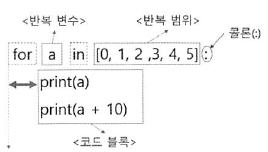

# 5장 - 제어문

날짜: 2020년 10월 14일

### 제어문

⚠️ 파이썬에서는 코드작성시 코드블록은 들여쓰기와 `:` 에 의해  범위가결정된다.  `{}` 를 쓰지않음!

- 비교연산자
    - `==`
        - 같다
    - `≠`
        - 같지않다
    - `>`
        - 초과
    - `<`
        - 미만
    - `≥`
        - 이상
    - `≤`
        - 이하
- 논리 연산자
    
- and, or, not
    
- 분기처리

    else if의 경우 elif로 축약되어 사용된다..

    ```python
    if condition: 
    	code...

    if condition: 
    	code...
    else: 
    	code...

    if condition: 
    	code...
    elif:
    	code...
    ```

### 반복문

---

반복문 역시 콜론을 사용하여 조건부분과 실행시킬 코드 블록 부분을 구별한다.

> 반복범위에 올 수 있는 변수의 타입은?

- 대표적으로 iterable한 타입 - list, dict, set, str, bytes, tuple, range



- `range(start, stop, step?)`

    반복문에서 반복 범위를 지정할 때, 자주 사용되는 함수

    `start` 

    - 시작숫자
    - 생략가능하며 생략시, 0이 기본값으로 입력됨

    `stop`

    - 종료숫자

    `stop`

    - 생성된 범위에서 n*step번째 인덱스만 가져오고 싶을 때 사용함
    - `range(1, 10)`

        → 1부터 10 바로 전 숫자인 9까지의 범위를 반환함 `[1,2,3,4,5,6,7,8,9]`

        - `range(10, 1, -3)`

            → `start`  값이  `end` 보다 큰 경우, `step` 값을 음수로 입력해야한다.

- `zip(arguments)`

    두 iterable한 객체를 하나의 튜플형태로 변환하여 반환한다.  zip으로 변환된 튜플은 `*` 연산자를 사용해서 `unzip`  할 수 있다.

    반한된 튜플은 인수로 받은 변수중에 가장 짧은 변수의 길이에 의해 결정된다.

    ```python
    >>> x = [1, 2, 3]
    >>> y = [4, 5, 6]
    >>> zipped = zip(x, y)
    >>> list(zipped)
    [(1, 4), (2, 5), (3, 6)]

    >>> x2, y2 = zip(*zip(x, y))
    >>> x == list(x2) and y == list(y2)
    True
    ```

- `break`

    반복문에서 반복을 빠져나오기 위해 사용한다.

- `continue`

    반복문상에서 바로 다음 루틴으로 이동시키기 위해 사용한다. (특정조건을 만족했다면 더 이상 아래 코드블록들을 실행시킬 필요가 없는 경우 사용)

- 한줄로 쓰는 `for`문 (컴프리헨션)

    파이썬에서는 list, set, dict 타입에 대해 한 줄 `for`문을 지원한다. 문법은 아래와 같다.

    ```python
    [<반복할 실행문> for <반복할 변수> in <반복범위>  <조건문>?]

    squre = [i**2 for i in range(1,6)]
    print(squre)
    [1, 4, 9, 16, 25]

    squre = [i**2 for i in range(1,6) if i % 2 == 1]
    print(squre)
    [1, 9, 25]

    squre = [i**2 for i in {1,6}]
    print(squre)
    [1, 36]

    squre = [i**2 for i in {1,6} if i % 2 == 1]
    print(squre)
    [1]

    squre = [i for i in {'a': 1,'b': 6}]
    print(squre)
    ['a', 'b']

    obj = {'a': 1,'b': 6}
    squre = [i for i in obj if obj[i] % 2 == 1]
    print(squre)
    ['a']

    ```